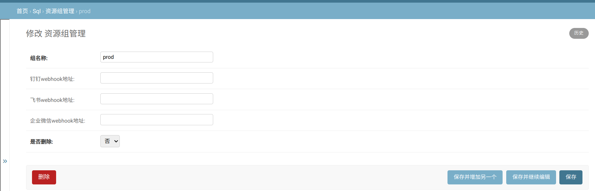
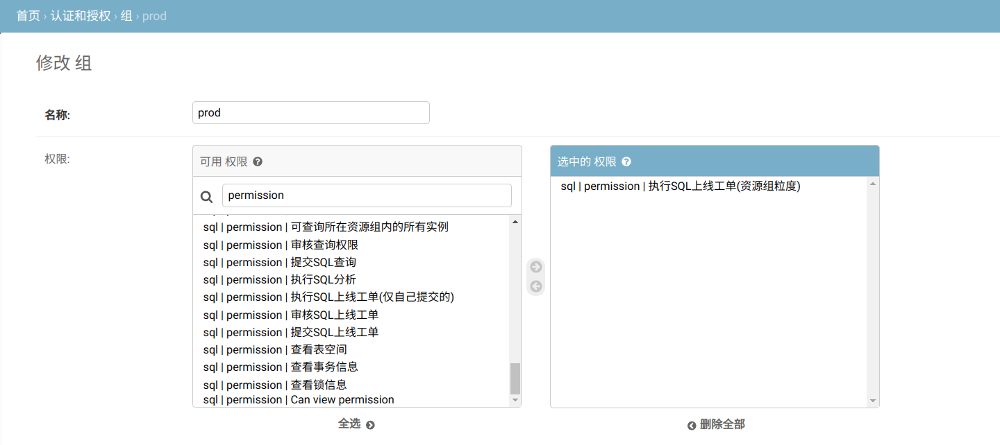
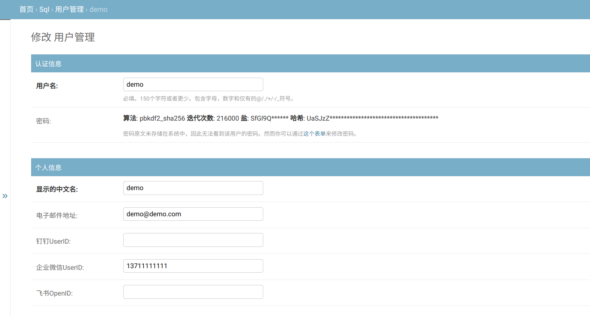

# archery-wechat archery工单微信机器人通知

## 说明
archery-wechat 是一个archery工单微信机器人通知工具
监听archery工单流程状态，当有新的工单时，通过微信机器人发送消息通知

### 消息推送规则
| 状态           | 推送人         |
|----------------|----------------|
| 等待审核人审核 | 当前审核组成员 |
| 审核通过       | 可执行组成员   |
| 人工终止流程   | 工单提交人     |
| 工作流异常     | 工单提交人     |
| 执行完成       | 工单提交人     |


## 依赖
- mysql
  - 需要有查询archery库权限
- redis
  - 需要增删改查权限
- wechat
  - 需要有发送消息权限 微信机器人webhook

## 部署

### archery 部署

> [参照archery官方wiki](https://github.com/hhyo/Archery/wiki/)

### archery-wechat 部署

#### docker
==修改配置文件==后运行
```bash
cd deploy/docker-compose
docker-compose up -d
```
#### kubernetes
==修改deployment.yaml文件中ConfigMap==后运行
```bash
cd deploy/kubernetes
kubectl apply -f deployment.yaml
```
#### 二进制部署

```shell
# 下载二进制
wget https://github.com/chenpeicheng3804/archery-wechat/releases/download/v1.0.0/archery-wechat_1.0.0_linux_$(uname -m | awk '{ if ($0 == "amd64" || $0 == "x86_64") print "amd64"; else if ($0 == "arm64" || $0 == "aarch64") print "arm64"; else print "未知架构" }') -O archery-wechat
chmod +x archery-wechat
# 启动
./archery-wechat -c config.yaml
```


## 配置文件
```yaml
mysql:
  user: root
  password: 123456
  host: 127.0.0.1
  port: 3306
  dbname: archery
redis:
  user: root
  password: 123456
  Addr: 127.0.0.1:6379
  db: 0
wechat:
  # 企微机器人webhook
  webhook: https://qyapi.weixin.qq.com/cgi-bin/webhook/send?key=xxxx
archery:
  # 消息推送工单链接地址
  webhost: http://127.0.0.1:9123
  # 监听资源组工单
  group:
    - prod
    - staging
```

## archery 配置

### 配置资源组、权限组

#### 资源组




#### 权限组

==名称需与资源组一致==，未配置相对应资源组的权限组，则不会推送待执行工单信息。

配置执行SQL上线工单权限




### 微信机器人通知@成员配置

配置 企业微信UserID:用户手机号




